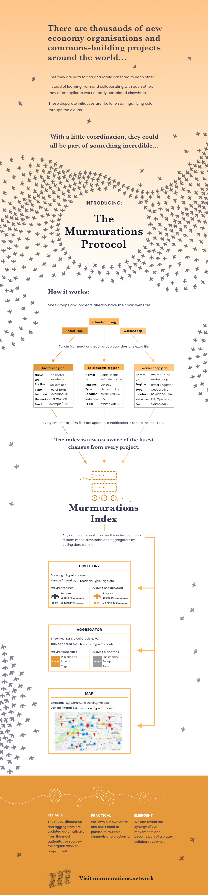

# MurmurationsProtocol

The Murmurations Protocol enables individuals and organizations (**nodes**) to create **profiles** about themselves in order to easily share information with **aggregators**, who create **schemas** to define the data they need to create maps, directories and content aggregators.

A [**library**](https://github.com/MurmurationsNetwork/MurmurationsLibrary) stores details of the schemas and the **fields** (data points) they are composed of.

A node pulls a schema from the library to determine the data needed to create a **profile**. You can [**try out the profile generator**](https://mpg.murmurations.tech) and create a node profile.

> _Currently the profile generator is in testing phase, so any information you create there will eventually be deleted when we release a production version (probably in early February 2021)._

An [**index**](https://github.com/MurmurationsNetwork/MurmurationsServices) keeps track of nodes and the schemas linked to their profiles. Whenever a node updates its profile it should tell the index. Aggregators regularly query the index for profile changes by nodes using their schemas, enabling them to provide accurate and timely information in their maps, directories and content aggregators.

## Why Murmurations?

