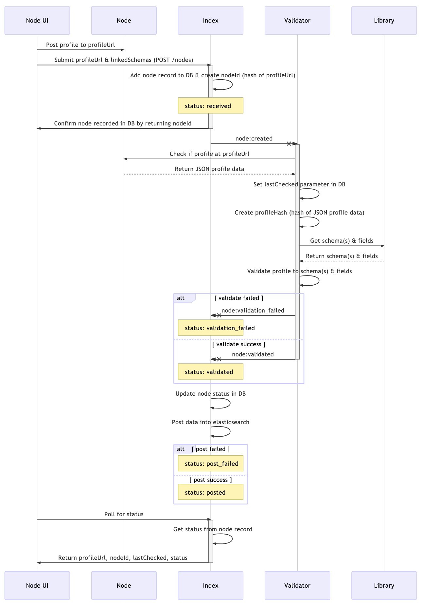

# Murmurations Index API

> :link: BASE URL
>
> https://index.murmurations.network/v1/{endpoint}

The Index API describes how nodes, using predefined schemas, add, update and delete their data in the index so that aggregators can discover them.

Schemas define collections of data fields that nodes can fill in to share information about themselves. Think of a schema as a form template and each instance of a completed form as a profile.

Nodes store their profiles on their website and then request them to be referenced in the index. The index validates that the profile meets the requirements of its associated schema(s). The index does not actually store the entire profile; it is only required to store the URL of the profile's location on the node's website (`profile_url`) and the name(s) of the schema(s) that profile is/are based upon and must be validated against (`linked_schemas`).

Using these two pieces of information, aggregators can then search the index for nodes with profiles that match specific schemas they want to use to create maps and directories, and the index returns a list of URLs (`profile_url`s) for the matched nodes' profiles. Aggregators then download from each node it's profile data for use in their apps.

The index will also store additional data to enable aggregators to locate nodes based on other information in addition to their associated schemas. This additional information will include, for example:

- _Geolocation data_ - latitude/longitude of primary location of entity - enables searching for nodes within a geographical range (i.e., "1 kilometer from my current location" or "60 miles from my home")
- _Location data_ - town/city, country, etc. for searching based on map location
- _Entity type_ - Wikipedia/Wikidata URL that best describes the organization type - enables searching for specific types of entities (e.g., food co-ops: [https://en.wikipedia.org/wiki/Food_cooperative](https://en.wikipedia.org/wiki/Food_cooperative))


> :construction: INDEX SYNCING
>
> A `profile_hash` is for future planning, and will also be stored for each node profile so that multiple indices can synchronize their lists of nodes. It will be a hash of the profile (the entire JSON object containing all node profile data) stored at the `profile_url` that was submitted by the node. Nodes can compare `node_id`s (the unique hash of a `profile_url`) and then `profile_hash`es between themselves. They will also store a Unix timestamp (`last_validated`) of when they last validated the profile at the `profile_url` and created the `profile_hash` for each `node_id`. The index with the oldest timestamp should download the profile from the `profile_url` and regenerate the `profile_hash`. This is just a rough idea of index syncing; it will need to be thought through in more detail, including thinking about edge cases.

## Node Endpoints

### [`POST /nodes`](https://app.swaggerhub.com/apis-docs/MurmurationsNetwork/IndexAPI/1.0#/Node%20Endpoints/post_nodes)

Node operators will call the `POST /nodes` endpoint to add their nodes to the index both when they first create a profile and to indicate when they have made changes to that profile.

They need to store their profile at a publicly accessible URL (`profile_url`), and then submit the `profile_url` to the index.

> :warning: SCHEMA REQUIREMENT
>
> A list of `linked_schemas` (array of strings) must be included in every profile (and therefore every schema) as a required field, so the library should never accept schemas and the index should never accept profiles without the `linked_schemas` property.
>
> Therefore all profiles will always contain a `linked_schemas` property:
> 
> ```json
> {
>   "linkedSchemas": [
>     "demo-v1",
>     "demo-v2"
>   ]
> }
> ```

#### Input

- Profile that validates to a referenced schema (or list of schemas), available at a publicly accessible URL
    - The profile must be available at the `profile_url` or it can't be recorded by the index
    - The profile must include one or more `linked_schemas` (unique schema name(s) within a namespace) against which the profile must be validated

#### Output

- `node_id` - hash of the `profile_url`

> :construction: HASH ALGORITHM
>
> The current implementation of the index uses the SHA256 hashing algorithm which produces a 64-character output. The purpose of hashing the `profile_url` is to make it easy to reference as a path parameter when requesting information about the node from the index (e.g., `GET /nodes/{node_id}` as described below).

#### Sequence Diagram - Add Node Profile to Index



### [`GET /nodes/{node_id}`](https://app.swaggerhub.com/apis-docs/MurmurationsNetwork/IndexAPI/1.0#/Node%20Endpoints/get_nodes__node_id_)

The record of a node in the index's database can be in one of five possible states: `received`, `validated`, `validation_failed`, `posted` or `post_failed`. The node will only be discoverable in the index when it has the status of `posted`.

This endpoint enables the Node UI to get and present an update to the node operator as to the status of the node profile after it has been submitted to the index (i.e., when using `POST /nodes`).

#### Input

- the `node_id` of the node's profile that is currently in the index

#### Output

##### Success

- Confirmation of status (e.g., `received`, `validated` or `posted`)

###### Received
```json
{
  "data": {
    "node_id": "a55964aeaae9625dc2b8dbdb1c4ce0ed1e658483f44cf2be1a6479fe5e144d38",
    "profile_url": "https://node.site/optional-subdirectory/node-profile.json",
    "status": "received"
  }
}
```

###### Validated

```json
{
  "data": {
    "node_id": "a55964aeaae9625dc2b8dbdb1c4ce0ed1e658483f44cf2be1a6479fe5e144d38",
    "profile_url": "https://node.site/optional-subdirectory/node-profile.json",
    "last_validated": 1601979232403,
    "status": "validated"
  }
}
```

###### Posted
```json
{
  "data": {
    "node_id": "a55964aeaae9625dc2b8dbdb1c4ce0ed1e658483f44cf2be1a6479fe5e144d38",
    "profile_url": "https://node.site/optional-subdirectory/node-profile.json",
    "last_validated": 1601979232403,
    "profile_hash": "c24d14c2c75f55d334a7e0ccf4d35a063a2582a7abb91e16d326f6613b9602bf",
    "status": "posted"
  }
}
```

##### Error

###### Validation Failed

_Could not download profile from `profile_url`_


```json
{
    "data": {
        "node_id": "a55964aeaae9625dc2b8dbdb1c4ce0ed1e658483f44cf2be1a6479fe5e144d38",
        "profile_url": "https://node.site/optional-subdirectory/node-profile.json",
        "status": "validation_failed"
    },
        "failure_reasons": [
            "Could not read from profile_url: https://node.site/optional-subdirectory/node-profile.json"
        ]
}
```

_Could not validate profile against one or more schemas_

```json
{
    "data": {
        "node_id": "a55964aeaae9625dc2b8dbdb1c4ce0ed1e658483f44cf2be1a6479fe5e144d38",
        "profile_url": "https://node.site/optional-subdirectory/node-profile.json",
        "status": "validation_failed"
    },
        "failure_reasons": [
            "demo-v1.geolocation.lat: Invalid type. Expected: number, given: string",
            "demo-v1.geolocation.lon: Invalid type. Expected: number, given: string"
        ]
}
```

_Could not find one or more schemas in library for validation_

```json
{
    "data": {
        "node_id": "a55964aeaae9625dc2b8dbdb1c4ce0ed1e658483f44cf2be1a6479fe5e144d38",
        "profile_url": "https://node.site/optional-subdirectory/node-profile.json",
        "status": "validation_failed"
    },
        "failure_reasons": [
            "Could not read from schema: demo-v3"
        ]
}
```

###### Post Failed
```json
{
  "data": {
    "node_id": "a55964aeaae9625dc2b8dbdb1c4ce0ed1e658483f44cf2be1a6479fe5e144d38",
    "profile_url": "https://node.site/optional-subdirectory/node-profile.json",
    "last_validated": 1601979232403,
    "status": "post_failed"
  },
    "failure_reasons": [
        "Profile not posted to index. Will reattempt soon when service is fully operational."
    ]
}
```

### [`DELETE /nodes/{node_id}`](https://app.swaggerhub.com/apis-docs/MurmurationsNetwork/IndexAPI/1.0#/Node%20Endpoints/delete_nodes__node_id_)

Node operators will use the `DELETE /nodes/{node_id}` endpoint to remove their profile from the index when they no longer want it listed.

#### Input

- the `node_id` of the profile that is currently in the index
    - The profile must no longer be available at the `profile_url` (i.e., should return a `404 Not Found` error when accessing the URL) or it will not be removed from the index

#### Output

##### Success

- Confirmation of removal (e.g., `200 OK` success status response code)

##### Error

- Return a `404 Not Found` error when the `node_id` does not exist in the index
- Return a `400 Bad Request` error when the profile is still available at its `profile_url` on the node's website

## Aggregator Endpoints

### [`GET /nodes`](https://app.swaggerhub.com/apis-docs/MurmurationsNetwork/IndexAPI/1.0#/Aggregator%20Endpoints/get_nodes)

> :lock: The `GET /nodes` endpoint will eventually require an API key in order to prevent unauthorized harvesting of data from the index.

Aggregators can search for nodes based on the schemas nodes use, when the nodes were last validated by the index (i.e., for recent changes to node profiles), and by geolocating nodes within a certain range (e.g., _10km_ or _6mi_) from a specific location or finding them based on the town/city, country, etc.

It is envisioned that other search parameters will be added to this endpoint as they are defined and deemed useful for aggregator searching.

> :construction: SEARCH BY ORGANIZATION TYPE
>
> The ability to search by type of organization will eventually be offered, but the methodology for defining and recording the organization type still needs to be determined. ([see this issue for updates](https://github.com/MurmurationsNetwork/MurmurationsProtocol/issues/6))

#### Input

- `schema` - unique schema name (only allow a single value per search)
- `last_validated` - Unix timestamp (in seconds)
- `geolocation` - `lat`, `lon` & `range`
- `location` - `locality`, `region`, `country`

#### Output

- Array of nodes with:
    - `profile_url`
    - `last_validated` (in seconds)
    - `geolocation` - an object containing `lat` & `lon`
    - `location` - an object containing `locality`, `region` & `country`
    - `linked_schemas` - an array containing a list of all schemas the node profile was validated against
