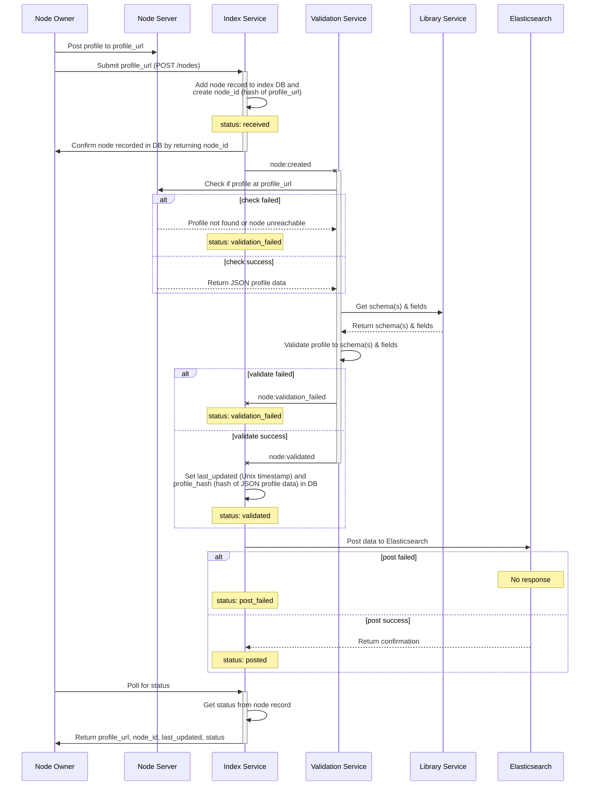

# Posting a node to an index

The following sequence diagram illustrates the series of steps taken between various services when posting a node to an index.

_Index Service_, _Validation Service_, _Library Service_ and _Elasticsearch_ are all services that are orchestrated inside of the [Murmurations Services](https://github.com/MurmurationsNetwork/MurmurationsServices) repository when it is instantiated.

The _Node Owner_ is the individual or organization operating the _Node Server_ that hosts the node's [profile](https://docs.murmurations.network/about/common-terms.html#profile).

